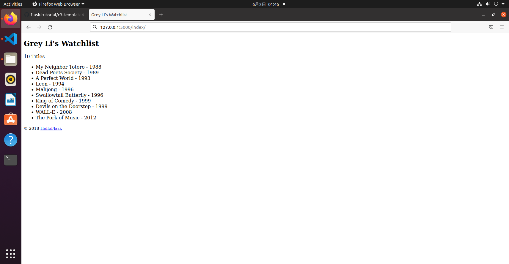

 ## CH2 templates
 * app.py
 ```python
name = 'Grey Li'
movies = [
    {'title': 'My Neighbor Totoro', 'year': '1988'},
    {'title': 'Dead Poets Society', 'year': '1989'},
    {'title': 'A Perfect World', 'year': '1993'},
    {'title': 'Leon', 'year': '1994'},
    {'title': 'Mahjong', 'year': '1996'},
    {'title': 'Swallowtail Butterfly', 'year': '1996'},
    {'title': 'King of Comedy', 'year': '1999'},
    {'title': 'Devils on the Doorstep', 'year': '1999'},
    {'title': 'WALL-E', 'year': '2008'},
    {'title': 'The Pork of Music', 'year': '2012'},
]
 def index():
    return render_template('index.html', name=name, movies=movies)
 ```
 * index.html
 ```html
 <!DOCTYPE html>
<html lang="en">
<head>
    <meta charset="utf-8">
    <title>{{ name }}'s Watchlist</title>
</head>
<body>
    <h2>{{ name }}'s Watchlist</h2>
    {# 使用 length 过滤器获取 movies 变量的长度 #}
    <p>{{ movies|length }} Titles</p>
    <ul>
          {# 迭代 movies 变量 #}
        <li>{{ movie.title }} - {{ movie.year }}</li>  {# 等同于 movie['title'] #}
          {# 使用 endfor 标签结束 for 语句 #}
    </ul>
    <footer>
        <small>&copy; 2018 <a href="http://helloflask.com/tutorial">HelloFlask</a></small>
	</footer>
</body>
</html>
 ```
 ### result
