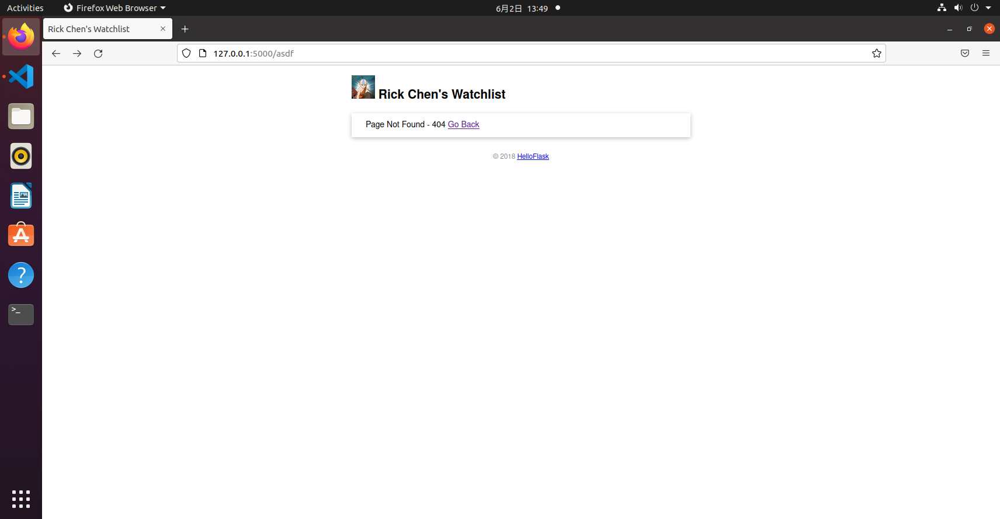
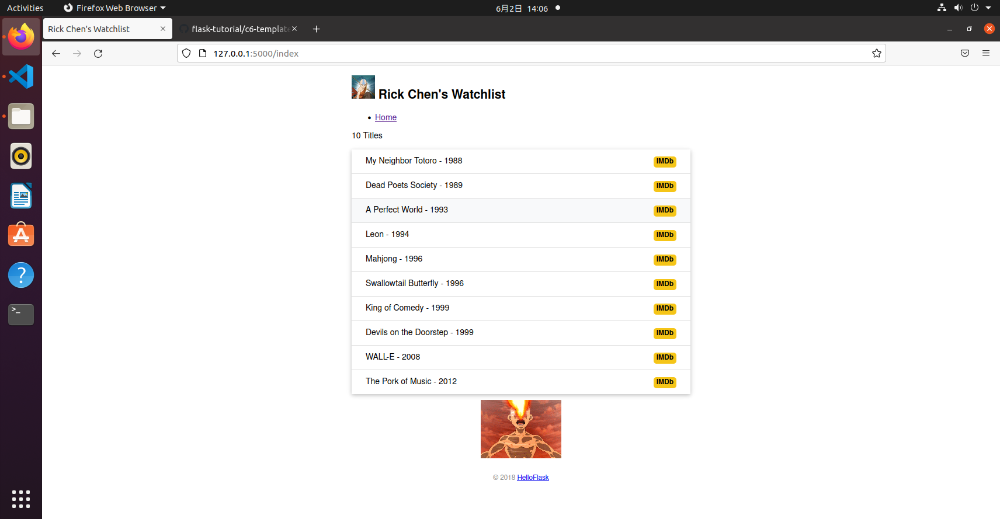

## CH5 模板优化
* 自定义错误页面
```python
@app.errorhandler(404)  # 传入要处理的错误代码
def page_not_found(e):  # 接受异常对象作为参数
    user = User.query.first()
    return render_template('404.html', user=user), 404  # 返回模板和状态码
```
```html
<!DOCTYPE html>
<html lang="en">
<head>
    <meta charset="utf-8">
    <title>{{ user.name }}'s Watchlist</title>
    <link rel="icon" href="{{ url_for('static', filename='favicon.ico') }}">
    <link rel="stylesheet" href="{{ url_for('static', filename='style.css') }}" type="text/css">
</head>
<body>
    <h2>
        
        {{ user.name }}'s Watchlist
    </h2>
    <ul class="movie-list">
        <li>
            Page Not Found - 404
            <span class="float-right">
                <a href="{{ url_for('index') }}">Go Back</a>
            </span>
        </li>
    </ul>
    <footer>
        <small>&copy; 2018 <a href="http://helloflask.com/tutorial">HelloFlask</a></small>
	</footer>
</body>
</html>
```
* 模板上下文处理函数
```python
@app.context_processor
def inject_user():  # 函数名可以随意修改
    user = User.query.first()
    return dict(user=user)  # 需要返回字典，等同于 return {'user': user}
```
* 使用模板继承组织模板
```html
<!DOCTYPE html>
<html lang="en">
<head>
    
    <meta charset="utf-8">
    <meta name="viewport" content="width=device-width, initial-scale=1.0">
    <title>{{ user.name }}'s Watchlist</title>
    <link rel="stylesheet" href="{{ url_for('static', filename='style.css') }}" type="text/css">
    
</head>
<body>
    <h2>
        
        {{ user.name }}'s Watchlist
    </h2>
    <nav>
        <ul>
            <li><a href="{{ url_for('index') }}">Home</a></li>
        </ul>
    </nav>
    
    <footer>
        <small>&copy; 2018 <a href="http://helloflask.com/tutorial">HelloFlask</a></small>
	</footer>
</body>
</html>
```
* 添加 IMDb 链接
```html



<p>{{ movies|length }} Titles</p>
<ul class="movie-list">
    
    <li>{{ movie.title }} - {{ movie.year }}
        <span class="float-right">
            <a class="imdb" href="https://www.imdb.com/find?q={{ movie.title }}" target="_blank" title="Find this movie on IMDb">IMDb</a>
        </span>
    </li>
    
</ul>


```
### result

