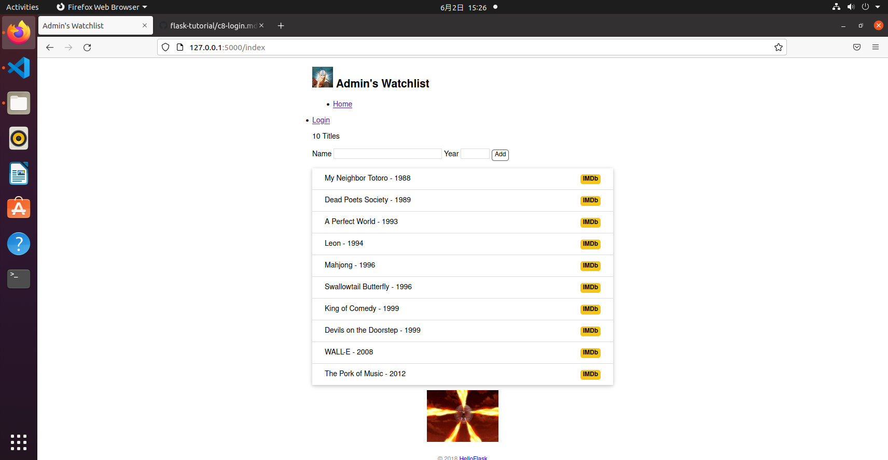
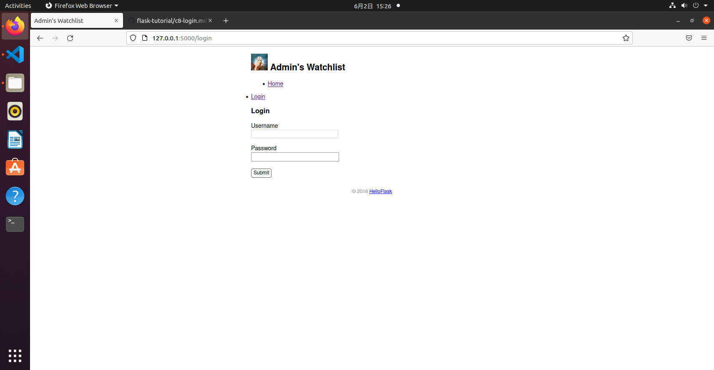
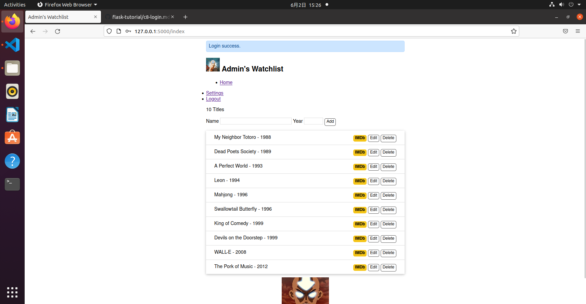

## CH7 用户认证
### 安全存储密码
* werkzeug.security.check_password_hash()
```python
>>> from werkzeug.security import generate_password_hash, check_password_hash
>>> pw_hash = generate_password_hash('dog')  # 为密码 dog 生成密码散列值
>>> pw_hash  # 查看密码散列值
'pbkdf2:sha256:50000$mm9UPTRI$ee68ebc71434a4405a28d34ae3f170757fb424663dc0ca15198cb881edc0978f'
>>> check_password_hash(pw_hash, 'dog')  # 检查散列值是否对应密码 dog
True
>>> check_password_hash(pw_hash, 'cat')  # 检查散列值是否对应密码 cat
False
```
### 生成管理员账户
* flask admin
```python
import click

@app.cli.command()
@click.option('--username', prompt=True, help='The username used to login.')
@click.option('--password', prompt=True, hide_input=True, confirmation_prompt=True, help='The password used to login.')
def admin(username, password):
    """Create user."""
    db.create_all()

    user = User.query.first()
    if user is not None:
        click.echo('Updating user...')
        user.username = username
        user.set_password(password)  # 设置密码
    else:
        click.echo('Creating user...')
        user = User(username=username, name='Admin')
        user.set_password(password)  # 设置密码
        db.session.add(user)

    db.session.commit()  # 提交数据库会话
    click.echo('Done.')
```
### 使用 Flask-Login 实现用户认证
```python
from flask_login import login_user

# ...

@app.route('/login', methods=['GET', 'POST'])
def login():
    if request.method == 'POST':
        username = request.form['username']
        password = request.form['password']

        if not username or not password:
            flash('Invalid input.')
            return redirect(url_for('login'))
        
        user = User.query.first()
        # 验证用户名和密码是否一致
        if username == user.username and user.validate_password(password):
            login_user(user)  # 登入用户
            flash('Login success.')
            return redirect(url_for('index'))  # 重定向到主页

        flash('Invalid username or password.')  # 如果验证失败，显示错误消息
        return redirect(url_for('login'))  # 重定向回登录页面
    
    return render_template('login.html')
```
```python 
login_manager = LoginManager(app)  # 实例化扩展类

@login_manager.user_loader
def load_user(user_id):  # 创建用户加载回调函数，接受用户 ID 作为参数
    user = User.query.get(int(user_id))  # 用 ID 作为 User 模型的主键查询对应的用户
    return user  # 返回用户对象

@app.route('/login', methods=['GET', 'POST'])
def login():
    if request.method == 'POST':
        username = request.form['username']
        password = request.form['password']

        if not username or not password:
            flash('Invalid input.')
            return redirect(url_for('login'))
        
        user = User.query.first()
        # 验证用户名和密码是否一致
        if username == user.username and user.validate_password(password):
            login_user(user)  # 登入用户
            flash('Login success.')
            return redirect(url_for('index'))  # 重定向到主页

        flash('Invalid username or password.')  # 如果验证失败，显示错误消息
        return redirect(url_for('login'))  # 重定向回登录页面
    
    return render_template('login.html')

@app.route('/logout')
@login_required  # 用于视图保护，后面会详细介绍
def logout():
    logout_user()  # 登出用户
    flash('Goodbye.')
    return redirect(url_for('index'))  # 重定向回首页

@app.route('/settings', methods=['GET', 'POST'])
@login_required
def settings():
    if request.method == 'POST':
        name = request.form['name']
        
        if not name or len(name) > 20:
            flash('Invalid input.')
            return redirect(url_for('settings'))
        
        current_user.name = name
        # current_user 会返回当前登录用户的数据库记录对象
        # 等同于下面的用法
        # user = User.query.first()
        # user.name = name
        db.session.commit()
        flash('Settings updated.')
        return redirect(url_for('index'))
    
    return render_template('settings.html')
```
### result


