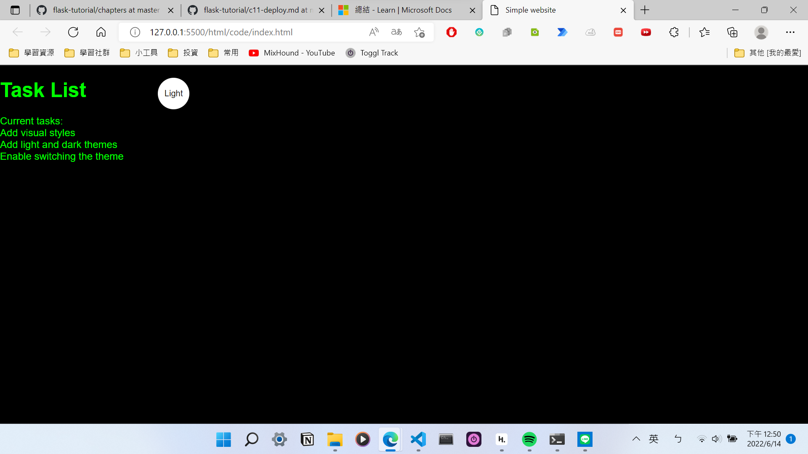
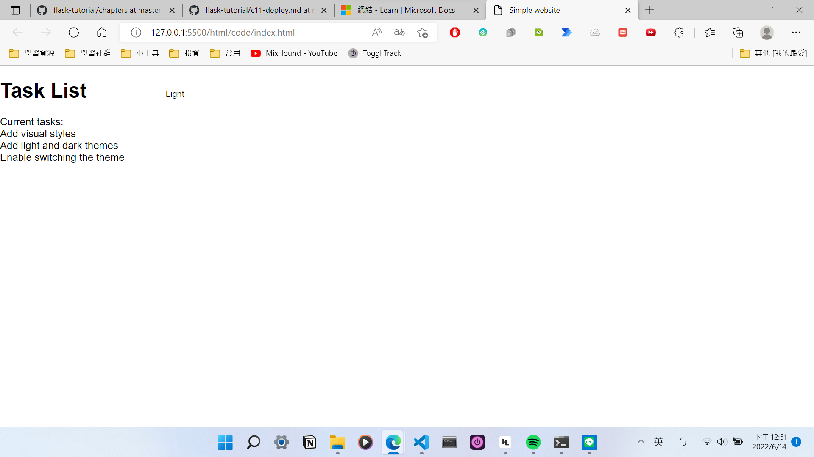
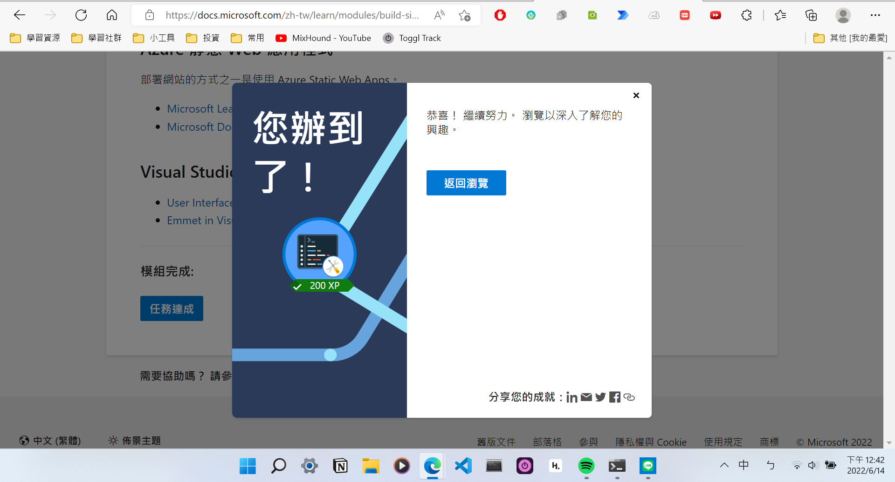

# Final tern HW1 HTML
## 成果: 透過按鈕進行深色模式跟淺色模式的切換


## 完成的截圖證明

## code
* [index.html](code/index.html)
```html
<!DOCTYPE html>
<html lang="en">
  <head>
    <meta charset="utf-8">
    <meta http-equiv="X-UA-Compatible" content="IE=edge">
    <meta name="viewport" content="width=device-width, initial-scale=1.0">
    <title>Simple website</title>
    <link rel="stylesheet" href="main.css">
  </head>
  <body class="dark-theme">
    <h1>Task List</h1>
    <p id="msg">Current tasks:</p>
    <ul>
      <li class="list">Add visual styles</li>
      <li class="list">Add light and dark themes</li>
      <li>Enable switching the theme</li>
    </ul>
    <div>
        <button class="btn">Dark</button>
      </div>
  </body>
  <script src="app.js"></script>
  <noscript>You need to enable JavaScript to view the full site.</noscript>
</html>
```
* [main.css](code/main.css)
```css
:root {
    --green: #00FF00;
    --white: #ffffff;
    --black: #000000;
  }
  * {
    color: var(--fontColor);
    font-family: helvetica;
  }
  body {
      background: var(--bg);
  }
  .light-theme {
    --bg: var(--green);
    --fontColor: var(--black);
    --btnBg: var(--black);
    --btnFontColor: var(--white);
  }
  
  .dark-theme {
    --bg: var(--black);
    --fontColor: var(--green);
    --btnBg: var(--white);
    --btnFontColor: var(--black);
  }
  .btn:focus {
    position: absolute;
  top: 20px;
  left: 250px;
  height: 50px;
  width: 50px;
  border-radius: 50%;
  border: none;
  color: var(--btnFontColor);
  background-color: var(--btnBg);
  }
```
* [app.js](code/app.js)
```javascript
'use strict'

const switcher = document.querySelector('.btn');

switcher.addEventListener('click', function() {
    document.body.classList.toggle('dark-theme')
    var className = document.body.className;
    if(className == "light-theme") {
        this.textContent = "Dark";
    }
    else {
        this.textContent = "Light";
    }
    console.log('current class name: ' + className);

});
```


